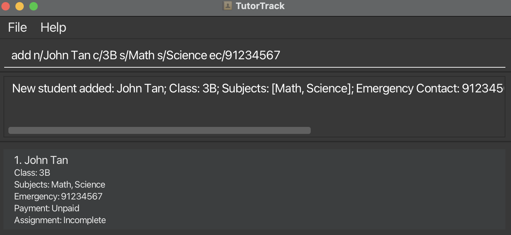
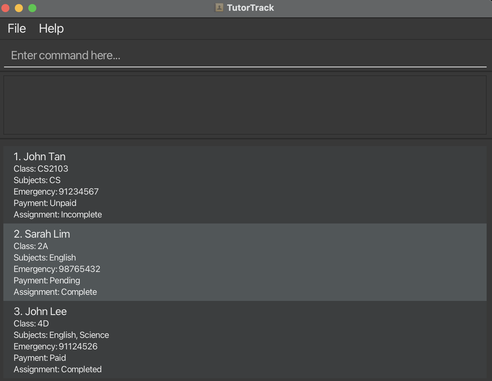
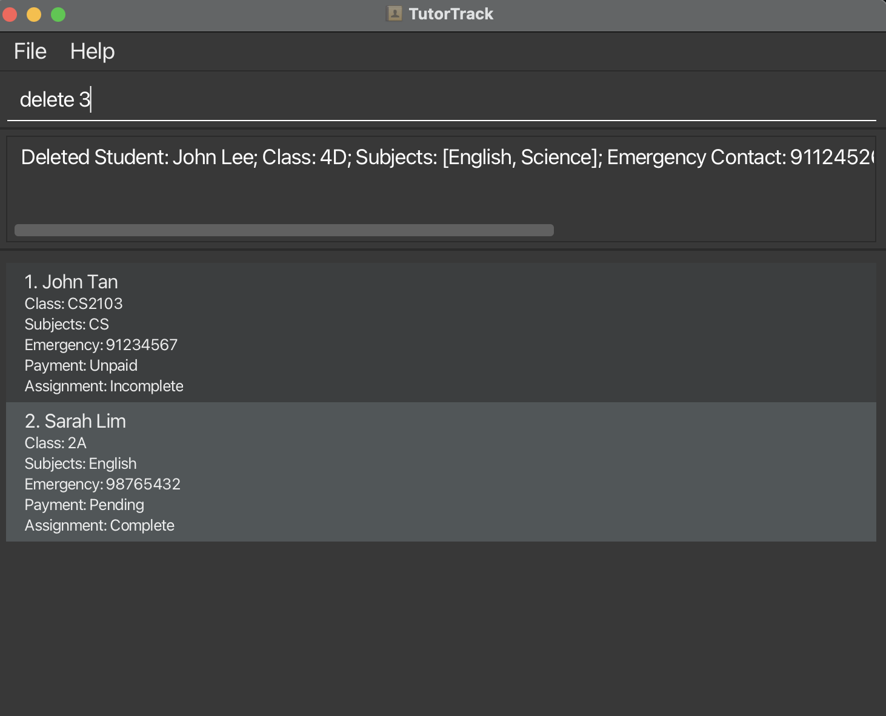

## Welcome to TutorTrack

TutorTrack is a **desktop app for managing contacts, optimized for use via a Command Line Interface** (CLI) while still having the benefits of a Graphical User Interface (GUI). If you can type fast, TutorTrack can get your student management tasks done faster than traditional GUI apps.

TutorTrack is designed to help you, as a tutor, efficiently organise and track your students. This includes adding, deleteing and archiving students as well as a students studental information such as name, subjects, payment status, attendance and much more.

* Table of Contents
{:toc}

--------------------------------------------------------------------------------------------------------------------

## Using this guide

* If you are new to TutorTrack, start with the Quick Start section to get set up and running in minutes.
* If you need help with specific commands, refer to the Command Summary for a concise overview.
* If you want a deeper understanding of a particular feature, explore the relevant section under Features.
* If you are a developer seeking technical or implementation details, check out our Developer Guide for architecture and design information.

--------------------------------------------------------------------------------------------------------------------

## Useful Notations and Glossary

While exploring TutorTrack, you will encounter several icons and terms used throughout this guide. The following tables explain their meanings to help you navigate the guide more effectively.

| Term | Meaning |
|:-----|:--------|
| **GUI** | *Graphical User Interface* — The visual interface of TutorTrack that displays students, subjects, and command results. |
| **CLI** | *Command Line Interface* — The text-based interface where users type commands to perform actions in TutorTrack. |
| **Command** | A text instruction entered by the user to perform an operation in TutorTrack (e.g., `add`, `delete`, `archive`). |
| **Parameter** | Information provided to a command to specify details. For example, in `add n/John Tan c/3B`, `n/John Tan` and `c/3B` are parameters. |
| **Case-sensitive** | When the casing of letters matters. For example, `add` is valid but `ADD` is not. |
| **Case-insensitive** | When the casing of letters does not matter. For example, `john` and `John` are treated as the same. |
| **Index** | The position number of a student as shown in the current displayed list (1-indexed). |
| **Mainstream OS** | Commonly used operating systems supported by TutorTrack — Windows, macOS, Linux, and Unix. |
| **Tutor** | An individual providing academic tutoring services. Tutors are the primary users of TutorTrack. |
| **Student** | A learner receiving academic tutoring. Each student has unique information (e.g., name, contact, subjects) and associated records (e.g., attendance, payments, academic performance). |
| **Parent Contact** | The emergency contact of a student’s parent or guardian, typically in the form of a phone number for safety and administrative purposes. |
| **Attendance** | The attendance record associated with a student, tracking presence, lateness, or absence for lessons. |
| **AttendanceStatus** | The recorded attendance status for a student during a lesson — can be **Present**, **Absent**, **Late**, or **Excused**. |
| **Archive** | A status indicating whether a student is **active** (currently enrolled or assigned to a tutor) or **archived** (no longer active but retained for recordkeeping). |
| **Subject Enrollment** | The mapping between students and the subjects they are studying. A student may be enrolled in multiple subjects. |
| **Payment Status** | The record indicating whether a student’s payment for tuition or lessons is **Paid**, **Unpaid**, or **Pending**. |


--------------------------------------------------------------------------------------------------------------------


## Quick start

1. Ensure you have Java `17` or above installed in your Computer.<br>
   **Mac users:** Ensure you have the precise JDK version prescribed [here](https://se-education.org/guides/tutorials/javaInstallationMac.html).

2. Download the latest `.jar` file from [here](https://github.com/se-edu/addressbook-level3/releases).

3. Copy the file to the folder you want to use as the _home folder_ for your AddressBook.

4. Open a command terminal, `cd` into the folder you put the jar file in, and use the `java -jar addressbook.jar` command to run the application.<br>
   A GUI similar to the below should appear in a few seconds. Note how the app contains some sample data.<br>
   

5. Type the command in the command box and press Enter to execute it. e.g. typing **`help`** and pressing Enter will open the help window.<br>
   Some example commands you can try:

   * `list` : Lists all students.

   * `add n/John Tan c/3B s/Math s/Science ec/91234567 ps/Paid as/Completed` : Adds a student named `John Tan` to the Address Book.

   * `delete 3` : Deletes the 3rd student shown in the current list.

   * `clear` : Deletes all students.

   * `exit` : Exits the app.

6. Refer to the [Features](#features) below for details of each command.

--------------------------------------------------------------------------------------------------------------------

## Navigating the GUI

(guide on how to use the GUI)


## Features

<div markdown="block" class="alert alert-info">

**:information_source: Notes about the command format:**<br>

* Words in `UPPER_CASE` are the parameters to be supplied by the user.<br>
  e.g. in `add n/NAME`, `NAME` is a parameter which can be used as `add n/John Doe`.

* Items in square brackets are optional.<br>
  e.g `n/NAME [ps/PAYMENT_STATUS]` can be used as `n/John Doe ps/Paid` or as `n/John Doe`.

* Items with `…`​ after them can be used multiple times.<br>
  e.g. `[s/SUBJECTS]…​` can be used as `s/Math`, `s/Math s/Science` etc.

* Extraneous parameters for commands that do not take in parameters (such as `help`, `list`, `exit` and `clear`) will be ignored.<br>
  e.g. if the command specifies `help 123`, it will be interpreted as `help`.

* If you are using a PDF version of this document, be careful when copying and pasting commands that span multiple lines as space characters surrounding line-breaks may be omitted when copied over to the application.
</div>

### Viewing help : `help`

Shows a message with a link to access the full help page.


**Format:** `help`

**What happens:** A help window opens with a link to this user guide.

---

### Adding a student: `add`

Adds a new student to the address book with their academic and contact information.

**Format:** `add n/NAME c/CLASS s/SUBJECT [s/SUBJECT]... ec/EMERGENCY_CONTACT [ps/PAYMENT_STATUS] [as/ASSIGNMENT_STATUS]`

**Parameters:**
* `n/NAME` - Student's full name (**required**)
* `c/CLASS` - Student's class (e.g., 3B) (**required**)
* `s/SUBJECT` - Subject(s) the student is taking (**at least one required**, use multiple `s/` prefixes to add more)
* `ec/EMERGENCY_CONTACT` - 8-digit Emergency contact phone number (**required**)
* `ps/PAYMENT_STATUS` - Payment status: Paid or Unpaid (_optional, default to Unpaid if omitted_)
* `asg/ASSIGNMENT_STATUS` - Assignment completion status: Completed or Incomplete (_optional, defaults to Incomplete if omitted_)

<div markdown="span" class="alert alert-primary">:bulb: **Tip:**
* You can add multiple subjects by using multiple `s/` prefixes
* Optional fields (PAYMENT_STATUS and ASSIGNMENT_STATUS) will use the default values mentioned if not specified
* Names are case-sensitive
</div>

<div markdown="span" class="alert alert-warning">:exclamation: **Caution:**
You cannot add a student with the same name and class as an existing student.
</div>

**Examples:**
* `add n/John Tan c/3B s/Math s/Science ec/91234567` (add command without optional fields)
  * Adds John Tan from class 3B (uses default values for optional fields)

  

* `add n/Sarah Lim c/2A s/English ec/98765432 ps/Paid as/Completed`
  * Adds Sarah Lim from class 2A

  

---

### Listing all students : `list`

Shows a list of all active (non-archived) students in the address book.


**Format:** `list`

**What it does:**
* Displays all students who have not been archived
* Returns you to the active student view if you were viewing archived students
* Students are shown with their index numbers, names, classes, and other details

**Expected output:**
```
Listed all students
```

<div markdown="span" class="alert alert-primary">:bulb: **Tip:**
Use this command to reset any filters and see all active students after using `find` or other filtering commands.
</div>

### Editing a student : `edit`

Edits an existing student in the address book.

Format: `edit [n/NAME] [c/CLASS] [s/SUBJECT...] [ec/EMERGENCY_CONTACT] [ps/PAYMENT_STATUS] [as/ASSIGNMENT_STATUS]`

* Edits the student at the specified `INDEX`. The index refers to the index number shown in the displayed student list. The index **must be a positive integer** 1, 2, 3, …​
* All fields are optional, but at least one of them needs to be provided
* Existing values will be updated to the input values.
* When you edit a Person (not originally a Student) with Student fields, they will be converted to Students, with their relevant fields updated to match Student fields.
* You can also edit **student-specific details**, such as:
  - `c/` → Student class
  - `s/` → Subject(s) (you may specify multiple)
  - `ec/` → Emergency contact
  - `pay/` → Payment status (e.g. `Paid`, `Pending`, `Overdue`)
  - `asg/` → Assignment status (e.g. `Submitted`, `Incomplete`, `Not Submitted`)

**Examples:**
* `edit 1 c/CS2103 s/Math, CS`
  Edits the **phone number** and **email address** of the 1st student.
  <figure>
    
    <figcaption><em>Before editing the student</em></figcaption>
  </figure>
  <figure>
    
    <figcaption><em>After editing the student</em></figcaption>
  </figure>

* `edit 2 pay/Pending`
  Edits the **Payment Status** of the 2nd student and clears all existing tags.
  <figure>
    
    <figcaption><em>Before editing the student</em></figcaption>
  </figure>
  <figure>
    
    <figcaption><em>After editing the student</em></figcaption>
  </figure>
* `edit 3 c/4C s/Math, Physics pay/Paid`
  Updates the class, subjects, and payment status of a Person, making them into a Student.
  <figure>
    
    <figcaption><em>Before editing the student</em></figcaption>
  </figure>
  <figure>
    
    <figcaption><em>Input for editing the student</em>
    </figcaption>
  </figure>
  <figure>
    
    <figcaption><em>After editing the student</em></figcaption>
  </figure>

### Locating students by name: `find`

Finds students whose names contain any of the given keywords.

Format: `find KEYWORD [MORE_KEYWORDS]`

* The search is case-insensitive. e.g `hans` will match `Hans`
* The order of the keywords does not matter. e.g. `Hans Bo` will match `Bo Hans`
* Only the name is searched.
* Only full words will be matched e.g. `Han` will not match `Hans`
* students matching all keywords will be returned (i.e. `AND` search).
  e.g. `find john tan` will return `john tan` and not `john wee`.

Examples:
* `find John` returns `John Teo` and `John Tan`

  

* `find InvalidStudentName` returns an empty list of students since no student is named `InvalidStudentName`<br>
  

### Deleting a student : `delete`

Deletes the specified student from the student list.

Format: `delete INDEX`

* Deletes the student at the specified `INDEX`. This action is **irreversible**
* The index refers to the index number shown in the displayed student list.
* The index **must be a positive integer** 1, 2, 3, …​
* The command works on the last shown list of students, which may be filtered (e.g., after using `find`)
* If the provided index is invalid (e.g., out of range), an error message will be shown.

Examples:
* `list` followed by `delete 2` deletes the 2nd student in the student list.
 
 
* `find John` followed by `delete 2` deletes the 2nd student in the results of the `find` command.
 
 
* `delete 3` where there are only 2 or fewer students results in the following error message:
   **"The person index provided is invalid"**
 

### Archiving a student : `archive`

Archives the specified student from the address book.

Format: `archive INDEX`

Moves a student into the **archive list**.
Archived students are **not deleted** and can be viewed anytime using `listarchive`.

**Format:** `archive INDEX`

**Details:**
* Archives the student at the specified `INDEX` (from the currently displayed list).
* The index must be a **positive integer**.
* Archived students are hidden from the main student list but **preserved** in the data file.
* You can use `listarchive` to view all archived students or restore them in future versions.

**Examples:**
* `archive 3` archives the 3rd student in the list.
<figure>
  
    <figcaption><em>Before archiving the student</em></figcaption>
  </figure>
  <figure>
    
    <figcaption><em>After archiving the student</em>
    </figcaption>
  </figure>

* `find Gary` followed by `archive 1` archives the 1st student in the filtered results.
<figure>
  
    <figcaption><em>Find the desired student</em></figcaption>
  </figure>
  <figure>
    
    <figcaption><em>Input for archiving Gary</em>
    </figcaption>
  </figure>
  <figure>
  
    <figcaption><em>Once student has been archived</em></figcaption>
  </figure>

### Viewing archived students : `listarchive`

Displays **all archived students** in the system.
Use this to view or verify students who have been archived previously.

**Format:** `listarchive`

**Details:**
* Displays a list of all archived students.
* This command has no parameters.
* Archived students retain all their details (class, subjects, attendance, payment, etc.) for recordkeeping.

**Example:**
* `listarchive`
  Shows all archived students with their full details.
  <figure>
  
    <figcaption><em>Archive List with all archived students</em></figcaption>
  </figure>

### Unarchiving students : `unarchive`

Unarchives students. Use this unarchive students that have been archived to bring them back to the main list.

**Format** `unarchive INDEX`

**Details:**
* Unarchives at the student at the specified `INDEX` (from the archive list).
* The index must be a **positive integer**.
* If the provided index is invalid (e.g out of range), an error message will be shown.

**Example:**
* `unarchive 1` unarchives index 1 `John Tan`.
<figure>
  
    <figcaption><em>Before unarchiving the student at index 1</em></figcaption>
</figure>
<figure>
    
    <figcaption><em>After unarchiving John Tan</em>
    </figcaption>
</figure>

* unarchiving an invalid index displays an error message.

<figure>
    
    <figcaption><em>Error message when unarchiving invalid index</em>
    </figcaption>
</figure>

### Clearing all entries : `clear`

Deletes **all students** from the active address book. This action is **irreversible**

**Format:** `clear`

**Details:**
* Permanently deletes all student records from the **main list**.
* Does **not** affect archived students.
* The data file is automatically updated after the operation.

**Example:**
* `clear`
  Removes every student from the current list.
  <figure>
    
    <figcaption><em>Student List before clearing</em></figcaption>
  </figure>
  <figure>
    
    <figcaption><em>Clear Command</em>
    </figcaption>
  </figure>
  <figure>
    
    <figcaption><em>Student List after clearing</em></figcaption>
  </figure>


<div markdown="span" class="alert alert-warning">:exclamation:**Caution:**
This command cannot be undone. All active records will be permanently deleted.
Archived records are not affected by this command.</div>

### Exiting the program : `exit`

Exits the program.

Format: `exit`

## Command Summary

| Action | Format, Examples (if necessary) |
|--------|------------------|
| **Help** | `help` |
| **Add** | `add n/NAME c/CLASS s/SUBJECT [s/SUBJECT]... ec/EMERGENCY_CONTACT [ps/PAYMENT_STATUS] [as/ASSIGNMENT_STATUS]`<br> e.g., `add n/John Tan c/3B s/Math s/Science ec/91234567 ps/Paid as/Completed` |
| **List** | `list` |
| **Edit** | `edit INDEX [n/NAME] [c/CLASS] [s/SUBJECT]... [ec/EMERGENCY_CONTACT] [ps/PAYMENT_STATUS] [as/ASSIGNMENT_STATUS]`<br> e.g., `edit 2 n/Betsy Crower c/4A s/Math s/Science ps/Pending` |
| **Find** | `find KEYWORD [MORE_KEYWORDS]` |
| **Delete** | `delete INDEX` <br> e.g., `delete 2` |
| **Archive** | `archive INDEX`<br> e.g., `archive 3` |
| **List Archived** | `listarchive` |
| **Unarchive** | `unarchive INDEX` <br> e.g., `unarchive 1` |
| **Clear** | `clear` |
| **Exit** | `exit` |

### Saving the data

AddressBook data are saved in the hard disk automatically after any command that changes the data. There is no need to save manually.

### Editing the data file

AddressBook data are saved automatically as a JSON file `[JAR file location]/data/addressbook.json`. Advanced users are welcome to update data directly by editing that data file.

<div markdown="span" class="alert alert-warning">:exclamation: **Caution:**
If your changes to the data file makes its format invalid, AddressBook will discard all data and start with an empty data file at the next run. Hence, it is recommended to take a backup of the file before editing it.<br>
Furthermore, certain edits can cause the AddressBook to behave in unexpected ways (e.g., if a value entered is outside of the acceptable range). Therefore, edit the data file only if you are confident that you can update it correctly.
</div>

### Archiving data files `[coming in v2.0]`

_Details coming soon ..._

--------------------------------------------------------------------------------------------------------------------

## FAQ

**Q**: How do I transfer my data to another Computer?<br>
**A**: Install the app in the other computer and overwrite the empty data file it creates with the file that contains the data of your previous AddressBook home folder.

--------------------------------------------------------------------------------------------------------------------

## Known issues

1. **When using multiple screens**, if you move the application to a secondary screen, and later switch to using only the primary screen, the GUI will open off-screen. The remedy is to delete the `preferences.json` file created by the application before running the application again.

2. **If you minimize the Help Window** and then run the `help` command (or use the `Help` menu, or the keyboard shortcut `F1`) again, the original Help Window will remain minimized, and no new Help Window will appear. The remedy is to manually restore the minimized Help Window.

------------------------------------------------------------------------------------------------------------
